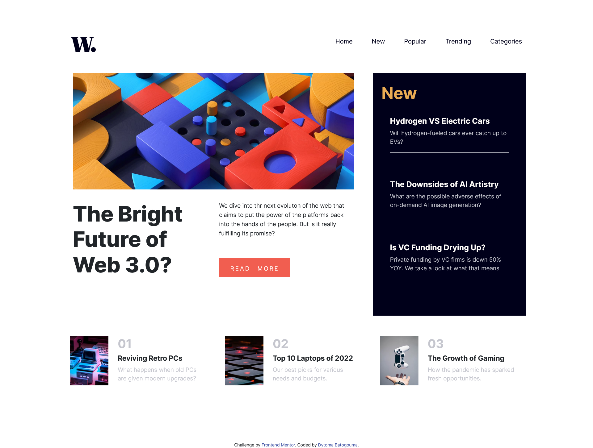

# news-homepage
Challenge from Frontend Mentor Junior level

# Frontend Mentor - News homepage solution

This is a solution to the [News homepage challenge on Frontend Mentor](https://www.frontendmentor.io/challenges/news-homepage-H6SWTa1MFl). Frontend Mentor challenges help you improve your coding skills by building realistic projects. 

## Table of contents

- [Overview](#overview)
  - [The challenge](#the-challenge)
  - [Screenshot](#screenshot)
  - [Links](#links)
- [My process](#my-process)
  - [Built with](#built-with)
  - [What I learned](#what-i-learned)
  - [Continued development](#continued-development)
  - [Useful resources](#useful-resources)
- [Author](#author)
- [Acknowledgments](#acknowledgments)

**Note: Delete this note and update the table of contents based on what sections you keep.**

## Overview

### The challenge

Users should be able to:

- View the optimal layout for the interface depending on their device's screen size
- See hover and focus states for all interactive elements on the page
- **Bonus**: Toggle the mobile menu (requires some JavaScript)

### Screenshot



This is the screenshot of my design for desktop, the items are not aligned perfectly.
### Links

- Solution URL: [Add solution URL here](https://your-solution-url.com)
- Live Site URL: [Add live site URL here](https://your-live-site-url.com)

## My process

### Built with

- Semantic HTML5 markup
- CSS custom properties
- SASS
- Flexbox
- CSS Grid
- Media queries for mobile design
- [Bootstrap](https://getbootstrap.com/) - Bootstrap 4 library


### What I learned
I tried to use bootstrap as a css library and I struggled a bit to get the alignments that I wanted maybe because bootstrap comes with a css file styling all the elements of the document file. 

I learned a bit about toggle menu even though my own isn't working perfectly, I tried to make some research but haven't figured out what was the issue and I'm opened for any recommendation and tips to perfect my skills.

To see how you can add code snippets, see below:

Some javaScript I've learnt.
```js
var navLinks = document.getElementById("nav-links");

    function showMenu() {
      navLinks.style.marginRight = "0";
    }

    function hideMenu() {
      navLinks.style.marginRight = "-200px";
    }
```

If you want more help with writing markdown, we'd recommend checking out [The Markdown Guide](https://www.markdownguide.org/) to learn more.


### Continued development

I would like to focus more on JavaScript DOM to design more interactive and responsive design. I would like also to know how to use Bootstrap which is powerfull tool for projects designing.


### Useful resources

- [Bootstrap](https://getbootstrap.com/) - This helped me for XYZ reason. I really liked this pattern and will use it going forward.
- [Youtube video on toggle menu](https://www.youtube.com/watch?v=oYRda7UtuhA&t=28s) - This is an amazing video which helped me design the toggle menu.


## Author

- Website - [Dytoma Omar](https://dytoma.github.io/cv/)
- Frontend Mentor - [@dytoma](https://www.frontendmentor.io/profile/Dytoma)
- Twitter - [@OmarDytoma](https://www.twitter.com/OmarDytoma)


## Acknowledgments

I just want to thank easytutorial from youtube where I learned a bit about toggle menu even though my design isn't perfect yet.


